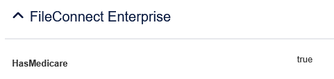

# FCE custom PII flags

This is a tool for identifying custom PII and setting flags in FCE. 

These custom flags will appear in RecordPoint metadata under the "Details" tab in the "FileConnect Enterprise" section.

## Installation

Install python

```bash
pip install pyyaml requests
```

## Usage

Basic usage is as follows:

```bash
python pii_detector.py [options] <index_name> <config.yml>
```

Where config.yml is a yaml file that defines the flag name, regular expression, and context words to search for.

### YAML file guidelines

Let's take as an example a Medicare number.


This is a 10 digit number which is likely to appear in documents in one of two ways:
1. A simple string of 10 continuous digits
2. Formatted as per the number in the above medicare card:
  - Four digits; followed by
  - Five digits; followed by
  - One digit (the issue number)

In other words likely to appear stylised in documents as either "NNNN-NNNNN-N" OR "NNNN NNNNN N" OR simply "NNNNNNNNNN".

We know that we want the field name in RecordPoint to be HasMedicare.

We know from analyzing the documents that the words "medicare", "bulk billing" or "mbs" (Medicare Benefits Schedule) are likely to appear shortly before the pattern.

Given this we would define the YAML file as such:

```yaml
fieldName: HasMedicare
patternRegex:
  - "[0-9]{4}"
  - "[0-9]{5}"
  - "[0-9]{1}"
contextWords:
  - medicare
  - "bulk billing"
  - mbs
```

"fieldName" is how you want the field to appear in RecordPoint.



"patternRegex" is used to define the way that the ten digits are "split up" in a way that is typical of medicare numbers when written in forms or other documents. Don't worry, 10 consecutive digits will still be caught using this method!

Finally "contextWords" is a requirement for at least one of these words to appear shortly before patternRegex in order to prevent a false positive.

### Flags

The following flags are available:

--dry-run: Reveals the elasticsearch query without executing it. Useful for troubleshooting.

--async: Useful for long running updates, as this can be used to do pii analysis in the background and shows progress (exit the process monitor with ctrl-c).

--search: Instead of updating matching documents with the PII flags returns the documents themselves. Useful for seeing what will be updated.

## Usage disclaimers

As you would probably expect you would first need to crawl and crack the documents in the index before you can run this as otherwise there will be no as otherwise there will be no document_text field to analyze.

There are some less obvious things to keep in mind, though.

### Compatibility with out of the box PII detection

FCE's out of the box pii scanner will append these fields to each document based on what it finds in document_text.

```json
"PII": {
  "HasPhone": false,
  "HasPCI": false,
  "HasPerson": false,
  "HasPII": false,
  "HasEmail": false
}
```

Worth noting is that after it does so it then proceeds to **delete** the document_text field.

Since pii_detector.py needs the document_text field it seems logical therefore that you should run pii_detector.py first, before the pii api has an opportunity to do so.

However the PII API will skip PII analysis on any documents that already has detected PII and this includes PII detected by pii_detector.py!

This means that if you want both out of the box PII and the PII provided by pii_detector.py you would need to do the following:

1. Crawl
2. Crack
3. OOB PII detection
4. Crack again
5. pii_detector.py
6. Use the clean_document_text api once analysis is done (pii_detector.py won't remove this and you may not want it staying around due to its large size)

Cracking twice is suboptimal though so you may want to decide on one or the other. If you want to go the route of custom PII only then:

1. Crawl
2. Crack
3. pii_detector.py for all required pii
4. Use the clean_document_text api once analysis is done (pii_detector.py won't remove this and you may not want it staying around due to its large size)

If you haven't run OOB PII detection before you submit then the error "[WARNING][fce] Type mapping not found for HasMedicare, assuming String type" will appear in the logs but this won't stop it from submitting.

## Checksum Validation

For certain types of PII, simple pattern matching may result in false positives. For example, any 9-digit sequence near tax-related words might be flagged as a Tax File Number, even if it's not a valid TFN according to the government's validation algorithm.

To address this, the tool supports checksum validation which applies the official validation algorithms to detected patterns, significantly reducing false positives.

### Enabling Checksum Validation

For checksum validation to work you will need to update all of your elasticsearch containers in dockerfile-vm-es3-http.yaml to add the line

```
- "script.painless.regex.enabled=true"
```

You will also need to uncomment this line from the discover container

```
- TEXT_KEYWORD_SIZE=32000
```

Add a `checksum` field to your YAML configuration:

```yaml
fieldName: HasTFN
patternRegex:
  - "[0-9]{3}"
  - "[0-9]{3}"
  - "[0-9]{3}"
contextWords:
  - tfn
  - tax
  - ato
checksum: weighted_mod_11
```

### Available Checksum Algorithms

- **weighted_mod_11**: Australian Tax File Number validation
- **repeating_weight_mod_10**: Australian Medicare number validation

### How It Works

When checksum validation is enabled:

1. The system finds all potential matches using the normal pattern and context matching
2. Each match is tested against the checksum algorithm
3. Only patterns that pass checksum validation are flagged as PII
4. Documents containing no valid patterns are marked with `false` instead of `true`

For example, with TFN validation enabled, the sequence "123 456 789" near "tax" might match the pattern, but if it fails the weighted mod 11 checksum, the document will show `HasTFN: false`.

### Benefits

- **Reduced false positives**: Only mathematically valid numbers are flagged
- **Compliance accuracy**: Ensures detected PII matches government validation standards
- **Performance**: Documents already analyzed are automatically skipped on subsequent runs
- **Flexibility**: Can be enabled per PII type as needed

### Adding New Checksum Algorithms

Custom checksum algorithms can be added by creating `.painless` files in the `checksums/` directory. The script receives a `cleanMatch` variable (digits only) and should set `passChecksum = true` if validation passes.

You can test custom algorithms in a painless lab by making the first two lines:

```
// Set passChecksum and cleanMatch to whatever you want below for testing in your painless lab
boolean passChecksum = false;
String cleanMatch = "1234567";
// Anything on this line or above will be removed
```

Paste your checksum algorithm underneath that. If cleanMatch passes then the value of passChecksum should be updated to "true".

Make the final few lines:

```
// Return statement goes here so you can validate if passChecksum is working in your lab -  this line and anything below it will be removed
return passChecksum
```

passChecksum will return true or false depending on the value you set in cleanMatch.
